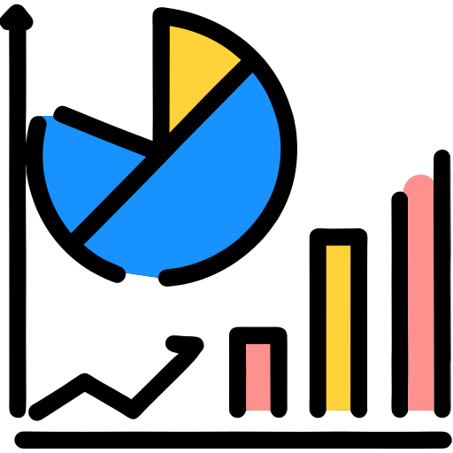

# `<chart-ease>`

## Customizable and high-performance web component to draw static charts.

chart-ease is a lightweight and highly customizable web component designed for creating small and precise charts. With its ability to normalize data from any range to a specified size, chart-ease makes it easier than ever to represent data in an elegant and effective way. Whether you're creating a simple line graph or a complex scatterplot, chart-ease makes it easy to build and display your data in a clear and meaningful way.

  

## Documentation

You can find the chart-ease documentation [on the website](https://n-yousefi.github.io/chart-ease/).
